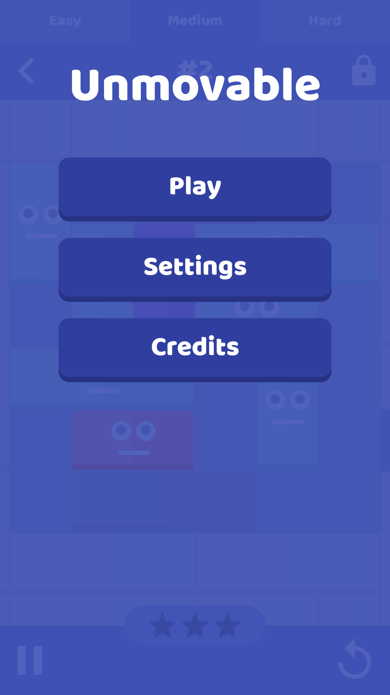
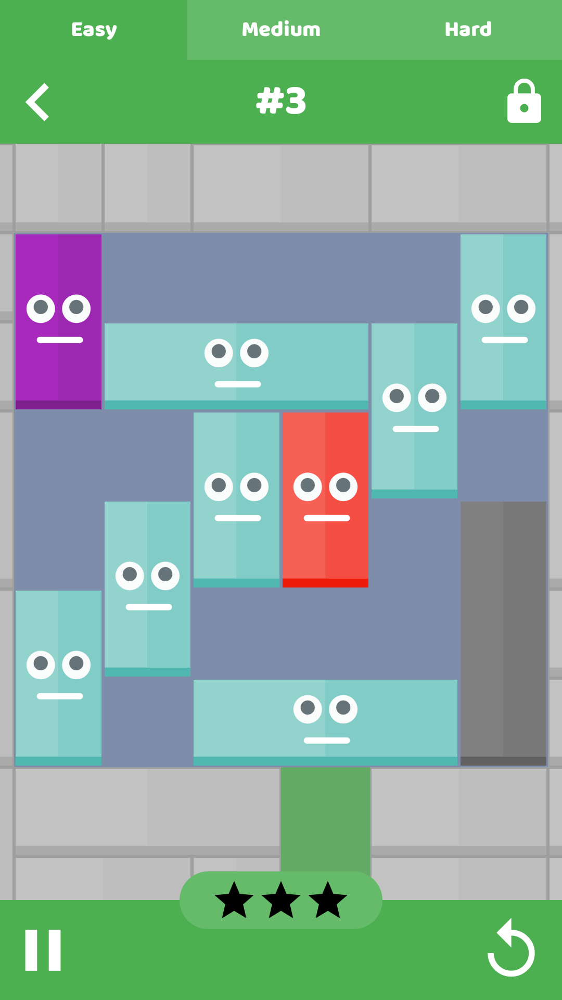
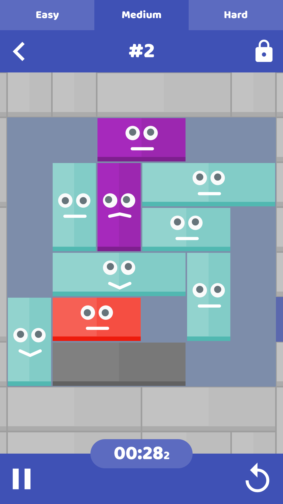
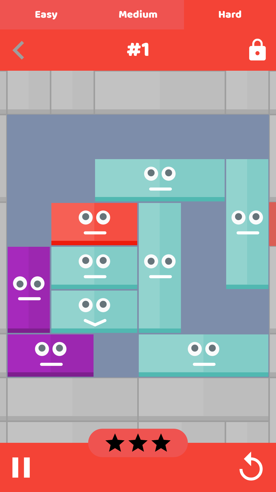

# Unmovable

<table>
  <tr>
    <td></td>
    <td></td>
    <td></td>
    <td></td>
  </tr>
</table>

Unmovable is a cross-platform (Android and iPhone) react-native puzzle game rush hour style).

The app is currently available on both Android and iOS platforms (this may not always be the case and the links may eventually not work).

[Play Store Link](https://play.google.com/store/apps/details?id=au.com.benl.unmovable)

[iTunes Store Link](https://itunes.apple.com/au/app/unmovable/id1190251517?mt=8)

## How To Use This

Unfortunately this is a bit of a dump of code, you're going to be on your own.

The good news is, you're welcome to use this however you like though. You can even use this commercially if you so choose.

## Notes

* Audio files have been removed from this project due to licensing.
